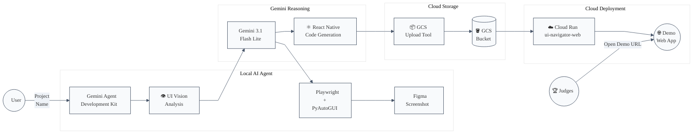

# 🚀 Figma to Code Powered by Gemini

An autonomous AI agent powered by **Gemini 3.1 Flash Lite Preview** and the **Gemini Agent Development Kit (ADK)** that interprets **Figma prototypes through computer vision** and generates **production-ready React Native code**, automatically deployed to **Google Cloud**.

---

# 🏗️ Architecture Overview

The system follows a **Hybrid Edge-Cloud Architecture**:

### Local Edge (Gemini ADK)
Orchestrates physical automation (**Playwright / PyAutoGUI**) to navigate Figma, handle UI state, and capture high-resolution screenshots.

### Multimodal Reasoning
**Gemini 3.1 Flash Lite Preview** analyzes visual input to extract exact branding, colors and layout hierarchies.

### Cloud Persistence
Generated code is persisted in **Google Cloud Storage**.

### Live Presentation
A **Google Cloud Run microservice** fetches and renders the latest build for stakeholders.

---

# 📐 System Architecture


---
# 🛠️ Reproducible Testing Instructions
Follow these steps to replicate the agent's behavior and the cloud deployment pipeline in your local environment.

1. Environment Prerequisites
Python 3.10+ installed.

Google Cloud SDK (gcloud) configured with an active project.

Google Chrome installed.

A Gemini API Key from Google AI Studio.

2. Local Setup & Installation
Bash
# Clone the repository
```bash
git clone https://github.com/julianez/gemini-ui-navigator.git
cd gemini-ui-navigator

# Create and activate a virtual environment
python -m venv .venv
source .venv/bin/activate  # On Windows: .venv\Scripts\activate

# Install dependencies
pip install -r requirements.txt
```

3. Browser Debugging Configuration
The agent requires a browser instance with Remote Debugging enabled to interact with the Figma canvas via Playwright/CDP.

Close all instances of Chrome.

Launch Chrome from the terminal/command prompt:

PowerShell
```bash
# Windows
"C:\Program Files\Google\Chrome\Application\chrome.exe" --remote-debugging-port=9222 --user-data-dir="C:\temp\chrome_debug"
```
Open Figma in this browser window and log in to your account.


4. Configuration (.env)
Create a .env file in the root directory:
```bash
Plaintext
GOOGLE_API_KEY=your_gemini_api_key
GCP_PROJECT_ID=your_project_id
GCS_BUCKET_NAME=your_bucket_name
```

5. Running the Agent
Open the Figma file you wish to process.

Ensure the browser window is visible (not minimized).

Execute the agent:

Bash
```bash
adk web --port 8000
```
Expected Result: You will see the mouse move autonomously as the agent captures the UI. The generated GeminiChallenge.tsx will be created locally and automatically uploaded to your GCS Bucket.


6. Cloud Verification
To verify the deployment on Google Cloud Run:

Bash
```bash
# Build and deploy the web dashboard
gcloud run deploy ui-navigator-web --source . --region us-central1 --allow-unauthenticated
```
Access the provided Service URL to see the React Native code rendered live from your Cloud Storage.
